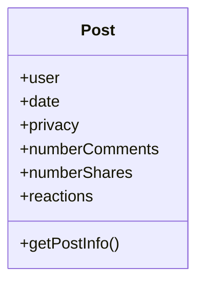

 # Ejercicio 1 : Modelado de GitHub

 ```mermaid
 classDiagram
 class Repo
 Repo : +name
 Repo : +author
 Repo : +language
 Repo : +numberOfCommits
 Repo : +stars
 Repo : +forks
 Repo : +issues_open
 Repo : +issues_close
 Repo : +getTotalIssues()
 Repo : +getGeneralInfo()
 ```

 ```mermaid
 classDiagram
 class Issue
 Issue : +title
 Issue : +repositoryNameAssociated
 Issue : +status
 Issue : +numberOfComments
 Issue : +labels
 Issue : +author
 Issue : +dateCreated
 Issue : +lastUpdated
 Issue : +getTitleAndAuthor()
 Issue : +getGeneralInfo()
 ```

 ```mermaid
 classDiagram
 class PullRequest
 PullRequest : +title
 PullRequest : +branchName
 PullRequest : +dateCreated
 PullRequest : +status
 PullRequest : +repositoryNameAssociated
 PullRequest : +getStatus()
 PullRequest : +getTitleAndAutor()
 ```

# Ejercicio 1.2 : Modelado de Twitter

```mermaid
 classDiagram
 class User
 User : +username
 User : +name
 User : +bio
 User : +age
 User : +location
 User : +dateJoined
 User : +topics
 User : +numberFollowers
 User : +numberFollowing
 User : +getNumberFollowers()
 User : +getNumberFollowing()
 User : +getTopics()
 ```

 ```mermaid
 classDiagram
 class Trending_topic
 Trending_topic : +topic
 Trending_topic : +numberTweets
 Trending_topic : +numberReplies
 Trending_topic : +numberLikes
 Trending_topic : +user
 Trending_topic : +dateCreated
 Trending_topic : +getNumberTweets()
 Trending_topic : +getNumberLikes()
 ```

# Ejercicio 1.3 : Modelado de Facebook

```mermaid
 classDiagram
 class User
 User : +name
 User : +basicInfo
 User : +friends
 User : +location
 User : +bio
 User : +currentCity 
 User : +details
 User : +getBasicInfo()
 User : +getDetails()
```




